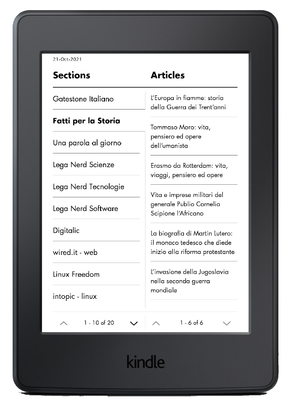

# Example of automated kindle digest
A simple script utilising Calibre for fetching rss feeds and sending them in the kindle periodical format to your kindle. For complete setup instructions see https://mattiasjohnson.com/kindle_weekly_digest/.

